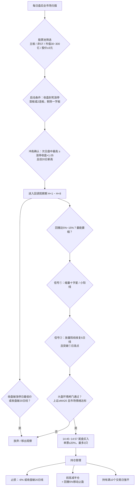

# 涨停冲高回调低吸策略（涨停回马枪 V1.0）

> **核心逻辑**：强势股涨停启动 → 次日冲高确认动能 → 缩量回调洗盘 → 止跌企稳信号出现 → 尾盘低吸买入 → 赚取反弹波段。
>
> - 版本：V1.0（待回测验证版）
> - 生成日期：2026-08-30
> - 参数来源标记：【已确认】= 用户明确确认；【默认】= 按建议采纳，可改；【待回测】= 初值，回测后调整

---

## 1. 策略概述

| 项目 | 内容 |
|---|---|
| 策略类型 | 短线事件驱动 + 形态量化（超短/波段，持有约 3~10 个交易日） |
| 适用市场 | 沪深主板 A 股（60x / 000 / 001 / 002 / 003 开头）【已确认】 |
| 涨跌幅制度 | 主板 ±10% 涨停 |
| 交易频率 | 预期每周 0~5 笔，视市场环境而定 |
| 盈利来源 | 强势股洗盘结束后的惯性反弹 / 二次上攻 |

### 1.1 决策流程图

---

## 2. 术语定义

| 术语 | 定义 |
|---|---|
| **启动日 T** | 启动段最后一个"收盘封死涨停"的交易日。首板策略中 T = 第 1 个涨停日；2 连板时 T = 第 2 个涨停日 |
| **冲高日 H** | T 的下一交易日，要求盘中冲高并创阶段新高 |
| **回调期** | H 之后第 1~8 个交易日（含），等待止跌信号出现的观察窗口 |
| **支撑 S1** | T 日最低价（涨停日最低价），收盘不可跌破 |
| **支撑 S2** | 20 日均线（MA20），收盘不可跌破 |
| **回撤深度 P** | (H 日最高价 − 信号前最低价) / H 日最高价 × 100% |

---

## 3. 股票池筛选（每日盘后执行）

以下条件为**硬性过滤**，任一不满足即剔除：

1. 板块：仅沪深主板（60x、000、001、002、003 开头）【已确认】
2. 剔除 ST、*ST 及退市整理期股票【已确认】
3. 剔除上市不足 60 个交易日的次新股【默认】
4. 剔除当日停牌股票
5. 收盘价 ≥ 3.00 元【已确认】
6. 流通市值 30 亿 ~ 300 亿【已确认】

---

## 4. 启动条件（涨停日 T）

1. **收盘封死涨停**：收盘价 = 当日涨停价（主板 10%）【已确认】
2. **连板数**：首板为主，允许 2 连板；3 连板及以上不做【已确认】
3. **剔除一字板**：T 日最低价 = 涨停价（全天未打开）视为一字板，剔除。理由：实际无法买入，且此类板次日溢价统计偏差大【默认，沿用建议】
4. **封板时间**（越早越强【已确认】）：
   - 首次封板时间 ≤ 10:30 → 强板，排序加分
   - 首次封板时间 ≥ 14:30 → 弱板，剔除
   - 盘中开板次数 ≤ 1 次（开板次数越少越强）
5. **换手率参考**：T 日换手率 < 3% 或 > 40% 剔除（极端缩量板关注度不足、极端放量板分歧过大）；其余仅作为排序参考【默认，待回测】

---

## 5. 冲高确认（冲高日 H）

涨停后**次日**冲高【已确认】，条件如下：

1. H = T 的下一交易日（2 连板情形时 T 为第二板，H 顺延至第三日）
2. H 日盘中最高价 ≥ T 收盘价 × **1.05**（冲高幅度 ≥ 5%，可调 3%~8%）【默认，待回测】
3. H 日盘中最高价创**近 20 个交易日新高**【默认】
4. H 日若再度收盘涨停（将形成 3 连板）→ 形态升级出本策略范围，放弃
5. H 日收盘涨跌不限，"冲高回落"为本策略主形态

---

## 6. 回调要求（H 后第 1~8 个交易日）

1. **观察窗口**：止跌信号必须出现在 H 后第 1~8 个交易日内，最早 H+2（至少经过 1 根回调 K 线）；第 9 日起仍未出现 → 移出观察【已确认，2~8 日】
2. **回撤深度**：P ∈ [5%, 15%]【已确认】
   - P < 5% 即出现止跌信号 → 回调不充分，谨慎（可放宽至 3%，参数化）
   - P > 15% → 放弃（深回调更可能是出货而非洗盘）
3. **支撑约束**（收盘价口径，任一破位立即放弃）【已确认】：
   - 收盘价 > T 日最低价（S1）
   - 收盘价 > MA20（S2）
4. **量能要求**（缩量回调才是洗盘，放量下跌是出货）：
   - 回调期日均成交量 ≤ H 日成交量 × 0.8【默认，待回测】
   - 信号①当日成交量 ≤ H 日成交量 × 0.5 为理想【默认】
5. 回调期内出现**收盘跌停**或单日跌幅 > 7% → 直接放弃，不属于洗盘特征

---

## 7. 止跌信号与买点【已确认：①+② 组合】

### 信号①：止跌试探

出现于 H+2 之后（含），满足全部条件：

| 条件 | 量化标准 |
|---|---|
| K 线形态 | 十字星（\|收−开\|/昨收 ≤ 0.5%）或小阳线（0 < 涨幅 ≤ 3%） |
| 缩量 | 当日成交量 ≤ H 日成交量 × 0.5 |
| 不破位 | 当日最低价不有效跌破 S1 / S2（收盘口径） |

### 信号②：反转确认

出现于信号①当日（同日双确认）或其后 1~2 个交易日内，满足全部条件：

| 条件 | 量化标准 |
|---|---|
| 阳线 | 收盘 > 开盘，收盘涨幅 ≥ 2% |
| 放量 | 当日成交量 ≥ 前一日 × 1.5 |
| 收复 5 日线 | 收盘价 ≥ MA5 |
| 突破确认 | 收盘价 ≥ 信号①日最高价 |

### 买入执行【默认，待回测】

- **时点**：信号②确认当日 **14:45~14:57** 尾盘买入（用收盘前数据确认，避免盘中假信号）
- 若 14:45 时条件②已全部满足 → 直接买入；14:45 后才满足 → 满足后立即买入（不晚于 14:57）
- 14:30 后直线拉升 > 3% 的尾盘急拉 → 放弃当日，等待次日回踩
- **建仓方式**：单票一次性买入，不分批；亏损后禁止补仓摊平

---

## 8. 同日多信号排序（选出 2~3 只）

同一交易日多只股票同时触发买入信号时，按以下打分排序，**取前 2~3 只**；总分 < 50 分则一只都不买【默认】：

| 维度 | 满分 | 评分要点 |
|---|---|---|
| 封板强度 | 30 | 首封时间越早分越高，≤10:30 满分；开板次数越少分越高 |
| 缩量程度 | 30 | 信号①量能 / H 日量能，比值越低分越高 |
| 板块热度 | 30 | 信号日所属板块当日涨幅排名进入市场前 30% 满分 |
| 回撤质量 | 10 | 回撤深度处于 8%~12% 最优区间满分，两端递减 |

---

## 9. 仓位管理

| 规则 | 数值 |
|---|---|
| 单票仓位上限 | 总资金的 20% |
| 同时持仓上限 | 3 只（对应总持仓上限 60%，保留现金） |
| 大盘闸门未通过 | 当日 0 新仓，存量持仓按卖出规则正常执行 |
| 加仓限制 | 禁止对亏损持仓加仓、摊平 |

---

## 10. 卖出规则【整体标记：初版参数，全部待回测优化】

| # | 规则 | 量化标准 | 执行方式 |
|---|---|---|---|
| S1 | 个股止损 | 盘中触及 买入价 × 0.94（−6%） | 触及即卖，先触发先执行 |
| S2 | 趋势止损 | 收盘价跌破 MA20 | 次日开盘卖出 |
| S3 | 前高减仓 | 触及前高（H 日最高价） | 卖出 1/2 仓位 |
| S4 | 移动止盈 | 收盘价自持仓期最高收盘价回撤 5% | 全部卖出 |
| S5 | 时间止损 | 持有满 10 个交易日（含买入日） | 全部卖出 |
| S6 | 涨停处理 | 持仓期间封死涨停 | 当日不卖；次日冲高不封板 / 盘中开板即卖 |

> S1 与 S2 孰先触发先执行。以上 −6%、5%、10 日均为初值，回测中优先扫描：止损 −4%~−8%、持有 5~15 日。

---

## 11. 风控体系（重点模块）

### 11.1 大盘环境闸门（一票否决，全部满足才可开新仓）【默认，待回测】

| 条件 | 标准 |
|---|---|
| 趋势 | 上证指数收盘 ≥ MA20 |
| 市场情绪 | 前一交易日两市涨停家数 ≥ 50 家 |
| 情绪质量 | 前一交易日炸板率 ≤ 40% |
| 亏钱效应 | 前一交易日跌停家数 ≤ 10 家，且 ≤ 涨停家数 |
| 大跌熔断 | 上证指数单日跌幅 ≥ 2% → 次日禁止开仓 |

### 11.2 存量持仓风控

- 上证指数收盘跌破 MA20 **连续 2 日** → 清仓观望，闸门恢复后重新入场
- 持仓个股触发 10. 节任一卖出规则 → 无条件执行，不抗单

### 11.3 账户级风控

- 单日买入笔数 ≤ 3 笔，单日新增仓位 ≤ 40%
- 连续 3 笔止损 → 暂停开仓 2 个交易日（冷却期）【默认】
- 单周账户回撤 ≥ 5% → 当周剩余时间禁止开仓【默认】

### 11.4 纪律条款

- 只执行**收盘确认**的信号，盘中不预判、不抢跑
- 观察名单之外的"看起来像"的机会一律不做，杜绝临场起意
- 每笔交易必须记录：信号快照、买入理由、卖出理由、盈亏，供复盘与参数迭代

---

## 12. 每日操作流程

| 时间 | 动作 |
|---|---|
| 08:30~09:15 盘前 | 更新股票池；校验大盘闸门；生成回调观察名单（H 后 1~8 日内的票）及今日潜在信号股 |
| 09:30~11:30 盘中 | 只观察不操作；监控持仓止损线；跟踪观察名单量价 |
| 13:00~14:45 | 同上；对潜在信号股预演排序打分 |
| 14:45~14:57 | 确认信号② → 打分排序 → 按仓位规则买入（≤3 只） |
| 14:57~15:00 | 持仓收盘检查：是否触发收盘破位止损 |
| 15:00 后 盘后 | 复盘记录交易日志；更新观察名单与参数统计 |

---

## 13. 特殊情形处理

| 情形 | 处理 |
|---|---|
| 除权除息 | 全程使用前复权数据；除权日形态中断，重新计算 |
| 持仓停牌 | 复牌首日按卖出规则判断；停牌期间不计入持有天数 |
| 回调期出现利空公告（立案、大额减持等） | 直接移出观察名单 |
| 买入当日尾盘拉板 | 视为强势，正常持有，按 S6 处理 |

---

## 14. 参数总表

| # | 参数 | 初值 | 可调范围 | 来源 |
|---|---|---|---|---|
| P1 | 适用板块 | 沪深主板 | — | 已确认 |
| P2 | 流通市值 | 30~300 亿 | 20~500 亿 | 已确认 |
| P3 | 股价下限 | 3.00 元 | 2~10 元 | 已确认 |
| P4 | 次新股剔除 | 上市 < 60 日 | 30~120 日 | 默认 |
| P5 | 连板数 | 1~2（首板为主） | 1~3 | 已确认 |
| P6 | 一字板 | 剔除 | — | 默认 |
| P7 | 首封时间 | ≤10:30 加分；≥14:30 剔除 | 10:00~14:30 | 已确认 |
| P8 | 冲高阈值 | ≥ +5% | 3%~8% | 默认，待回测 |
| P9 | 创新高窗口 | 20 日 | 10~30 日 | 默认 |
| P10 | 回撤区间 | 5%~15% | 3%~25% | 已确认 |
| P11 | 回调时限 | H 后 1~8 日 | 1~10 日 | 已确认 |
| P12 | 支撑 S1 | 涨停日最低价 | 涨停日收盘价 / 5 日线 | 已确认 |
| P13 | 支撑 S2 | MA20 | MA10 / MA30 | 已确认 |
| P14 | 回调缩量 | 日均 ≤ H 日 ×0.8；① ≤ H 日 ×0.5 | 0.5~1.0 | 默认，待回测 |
| P15 | 信号① | 缩量十字星 / 小阳（0~+3%） | — | 已确认 |
| P16 | 信号② | ≥+2% 放量 1.5 倍阳线收复 MA5 | — | 已确认 |
| P17 | 买入时点 | ②确认日 14:45~14:57 | 开盘 / 尾盘 | 默认，待回测 |
| P18 | 止损 | −6% 或收盘破 MA20 | −4%~−8% | 待回测 |
| P19 | 止盈 | 前高减半 + 回撤 5% 移动止盈 | — | 待回测 |
| P20 | 最大持有 | 10 个交易日 | 5~15 日 | 待回测 |
| P21 | 单票仓位 | ≤ 20% | 10%~30% | 默认 |
| P22 | 持股上限 | 3 只 | 2~5 只 | 默认 |
| P23 | 大盘闸门 | 上证≥MA20；涨停≥50 家；炸板率≤40%；跌停≤10 家 | — | 默认，待回测 |
| P24 | 冷却规则 | 连续 3 笔止损停 2 日；周回撤 5% 停当周 | — | 默认 |

---

## 15. 回测验证清单（为下一步准备）

1. **数据需求**：日线（前复权）、涨停价与首封时间（需分时/快照数据；日线回测可用"收盘价 = 涨停价"近似判定封死）、板块归属、流通市值。
2. **口径注意**：一字板、开盘秒板实际买不进，回测必须按"可买入"口径统计，否则收益高估；尾盘买入建议用 14:45 后均价近似成交价并计滑点。
3. **建议区间**：2019-01-01 ~ 2024-12-31 训练，2025 年样本外验证；分年度、分市场环境（闸门开/关）分层统计。
4. **评估指标**：交易次数、胜率、盈亏比、单笔期望、年化收益、最大回撤、平均持有天数。
5. **优先扫描参数**：止损（P18）、冲高阈值（P8）、回撤区间（P10）、持有天数（P20）。
6. **过拟合控制**：每次只动一个参数；样本外必须验证；交易样本 < 100 笔的参数组合不采信。

---

## 16. 风险提示与策略局限

- 本策略属于短线情绪类策略，在市场退潮期会成批触发止损，大盘闸门只能缓解、不能消除该风险。
- 涨停次日溢价的分布会随市场风格漂移，参数需定期用新数据再校准。
- 尾盘集中买入存在滑点；小市值票流动性有限，资金规模过大后策略容量下降。
- 交易规则变化（涨跌幅制度、印花税等）可能改变策略前提。
- 本文档为策略研究框架，不构成投资建议。
